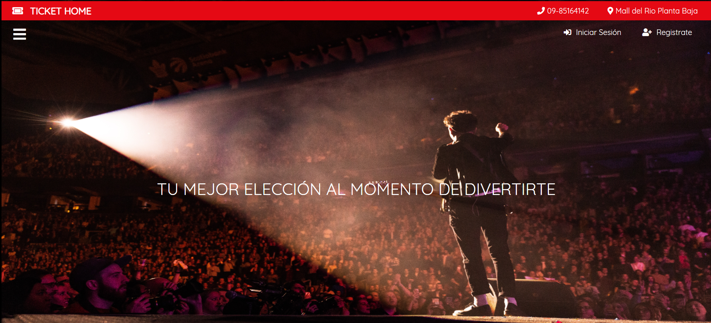
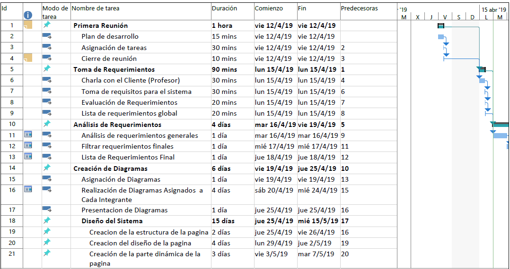

# GESTION DE PEDIDOS PARA VENTA DE BOLETOS PARA ENTRETENIMIENTO

Lo que se busca en este proyecto es crear unsistema que sirva para la venta de boletos de todo tipo de eventos, ya sea de entretenimiento, conciertos, teatro... etc. Este proyecto se realiza con el objetivo de mejorar los conocimientos sobre html, css, javascript, php. A continuación mostramos todo lo que se ha estado realizando para llevar a cabo con éxito este proyecto.

 

## Tabla de contenido
- [URL de Página Web](#URL-de-Página-Web).
- [Slack](#Slack).
- [Cronograma](#CRONOGRAMA).
- [Toma de Requerimientos](#REQUERIMIENTOS).
- [Base De Datos](#Base-De-Datos).

# URL

En esta url se puede ver como se esta llevando a cabo la realización del sistema web. La página web esta montado en un servidor Cloud llamado Digital Ocean, esta fue la opción más factible y más facil de utilizar, el sistema operativo que se utilizó es Centos para poder levantar todos los servicios que necesitamos. Aquí la IP del Sistema Web

http://134.209.68.216/

# Slack 

Por medio del Slack tenemos todos los requerimientos y diagramas que hemos realizado a lo largo del proyecto del sistema, todo fue llevado correctamente desde la toma de requerimiento hasta el diseño de diagramas

**URL:** https://fooddriverhipermedial.slack.com

# CRONOGRAMA
Antes de poder hacer todo el proyecto se empezo con el cronograma de actividades el cual tenia el objetivo de cumplir con todas las actividades propuestas para obtner un buen sistema, el cronograma para el proyecto fue desarrollado por Bryam Vega Jefe de Grupo, dejandolo de la siguiente manera:



Como se puede apreciar las primeras partes hablamos sobre la primera reunión y por consiguiente asignamos tareas a cada integrante del grupo los cuales estan cargados en slack en donde cual trabajamos simultaneamente para obtener buenos resultados.

# REQUERIMIENTOS

Una de las partes más importantes al momento de realizar un sistema es obtener la toma de requerimientos, de tal manera que se puedan realizar los requisitos que el usuario necesita para su sistema, la toma de requisitos fue hecha por Adrian Viscaino quien conjuntamente con el cliente obtuvo los siguientes requisitos.


# Base De Datos

El nombre de la base de datos es **entretenimiento** y las tablas creadas fueron pensadas detenidamente para generar una base de datos consistente respetando las reglas de normalización y al mismo tiempo viendo que todas las tablas esten bien referenciadas y cualquier persona que desee utilizar la pueda entender

### **T_ROLES**

Esta tabla nos permite elegir el rol de la persona que va a entrar al sistema web si va a ser un usuario, un administrado una empresa etc
```
CREATE TABLE T_ROLES(
 rol_id           int NOT NULL PRIMARY KEY AUTO_INCREMENT,
 rol_desc         varchar(15) NOT NULL,
 rol_usu_crea     varchar(7) NOT NULL,
 rol_fec_crea     date NOT NULL,
 rol_usu_modifica varchar(7),
 rol_fec_modifica date,
 rol_usu_elimina  varchar(7),
 rol_fec_elimina  date,
)ENGINE=InnoDB DEFAULT CHARSET=utf8 AUTO_INCREMENT=1;
```

### **T_CATEGORIAS**

Esta tabla de categorias permite tener distintas categorias de eventos que el sistema web va a ofrecer al publico en general
```
CREATE TABLE T_CATEGORIAS(
 cat_id  int NOT NULL PRIMARY KEY AUTO_INCREMENT,
 cat_desc varchar(100) NOT NULL,
 cat_usu_crea     varchar(7) NOT NULL,
 cat_fec_crea     date NOT NULL,
 cat_usu_modifica varchar(7),
 cat_fec_modifica date,
 cat_usu_elimina  varchar(7),
 cat_fec_elimina  date,
 cat_estado_elimina varchar(2) DEFAULT 'N',
)ENGINE=InnoDB DEFAULT CHARSET=utf8 AUTO_INCREMENT=1;
```

### **T_USUARIOS**

Cada usuario que se vaya registrando en el sistio web sera insertado en dicha tabla
```
CREATE TABLE T_USUARIOS(
 usu_id             int NOT NULL PRIMARY KEY AUTO_INCREMENT,
 usu_fec_nac        date NOT NULL,
 usu_cedula         varchar(10) UNIQUE KEY NOT NULL,
 usu_nombres        varchar(50) NOT NULL,
 usu_apelidos       varchar(50) NOT NULL,
 usu_edad           int  NOT NULL,
 usu_telefono       varchar(12) NOT NULL,
 usu_direccion      varchar(150) NOT NULL,
 usu_correo         varchar(50) NOT NULL,
 usu_img            longblob,
 usu_img_tipo       varchar(150),
 usu_crea           varchar(7) NOT NULL,
 usu_fec_crea       date NOT NULL,
 usu_modifica       varchar(7),
 usu_fec_modifica   date,
 usu_elimina        varchar(7),
 usu_fec_elimina    date,
 usu_estado_elimina varchar(2) DEFAULT 'N',
 usu_rol_id         int NOT NULL
 FOREIGN KEY (usu_rol_id) REFERENCES T_ROLES(rol_id)
)ENGINE=InnoDB DEFAULT CHARSET=utf8 AUTO_INCREMENT=1;
```

### **T_EMPRESAS**

La tabla empresa se va a utilizar para poder registrar todas las empresas que se van a hacer cargo de los eventos tomando en cuenta la categoria y su rol
```
CREATE TABLE T_EMPRESAS(
 emp_id              int NOT NULL PRIMARY KEY AUTO_INCREMENT,
 emp_ruc             varchar(13) UNIQUE KEY NOT NULL,
 emp_nombre          varchar(100) NOT NULL,
 emp_direccion       varchar(150) NOT NULL,
 emp_telefono        varchar(12) NOT NULL,
 emp_crea            varchar(7) NOT NULL,
 emp_fec_crea        date NOT NULL,
 emp_modifica        varchar(7),
 emp_fec_modifica    date,
 emp_elimina         varchar(7),
 emp_fec_elimina     date,
 emp_estado_elimina  varchar(2) DEFAULT 'N',
 emp_cat_id          int NOT NULL,
 FOREIGN KEY (emp_cat_id) REFERENCES T_CATEGORIAS(cat_id)
)ENGINE=InnoDB DEFAULT CHARSET=utf8 AUTO_INCREMENT=1;
```

### **T_EVENTOS**

La tabla de eventos se utilizara para registrar los eventos que se van a mostrar a los usuarios para que puedan comprar sus boletos y la tabla ira actualizando los asientos por cada compra dependiendo de un general, tribuna, vip, box

```
CREATE TABLE T_EVENTOS(
 evt_id             int NOT NULL PRIMARY KEY AUTO_INCREMENT,
 evt_desc           varchar(1000) NOT NULL,
 evt_fec_evento     date NOT NULL,
 evt_direccion      varchar(150) NOT NULL,
 evt_img			longblob NOT NULL,
 evt_img_tipo       varchar(50),
 evt_asientos       int NOT NULL,
 evt_gen            int DEFAULT 0,
 evt_trib           int DEFAULT 0,
 evt_vip            int DEFAULT 0,
 evt_box            int DEFAULT 0,
 evt_precio         int NOT NULL DEFAULT 0,
 evt_gen_precio     int DEFAULT 0,
 evt_trib_precio    int DEFAULT 0,
 evt_vip_precio     int DEFAULT 0,
 evt_box_precio     int DEFAULT 0,
 evt_vendidos       int DEFAULT 0,
 evt_usu_crea       varchar(7) NOT NULL,
 evt_fec_crea       date NOT NULL,
 evt_usu_modifica   varchar(7),
 evt_fec_modifica   date,
 evt_usu_elimina    varchar(7),
 evt_fec_elimina    date,
 evt_estado_elimina varchar(2) DEFAULT 'N',
 evt_emp_id         int NOT NULL,
 FOREIGN KEY (evt_emp_id) REFERENCES T_EMPRESAS(emp_id)
)ENGINE=InnoDB DEFAULT CHARSET=utf8 AUTO_INCREMENT=1;
```
### T_FACTURA_CABECERA
```
CREATE TABLE T_FACTURA_CABECERA (
 fc_id int(11) NOT NULL AUTO_INCREMENT,
 fc_fecha timestamp NOT NULL DEFAULT CURRENT_TIMESTAMP,
 fc_usu_id int(11) NOT NULL,
 PRIMARY KEY (fc_id),
 KEY fc_usu_id (fc_usu_id),
 FOREIGN KEY (fc_usu_id) REFERENCES T_USUARIOS (usu_id)
) ENGINE=InnoDB DEFAULT CHARSET=utf8 AUTO_INCREMENT=1;
```

### T_FACTURA_DETALLE
```
CREATE TABLE T_FACTURA_DETALLE (
	fd_id  int 	NOT NULL AUTO_INCREMENT PRIMARY KEY,
    fd_cantidad int NOT NULL,
    fd_precio   int NOT NULL,
    fd_fc_id    int NOT NULL,
    fd_evt_id   int NOT NULL,
    FOREIGN KEY(fd_fc_id) REFERENCES T_FACTURA_CABECERA(fc_id),
	FOREIGN KEY(fd_evt_id) REFERENCES T_EVENTOS(evt_id)    
)ENGINE=InnoDB DEFAULT CHARSET=utf8 AUTO_INCREMENT=1;
```

### T_CONTACTOS
```
CREATE TABLE T_CONTACTOS(
	cnt_id int NOT NULL PRIMARY KEY AUTO_INCREMENT,
    cnt_nombre varchar(150) NOT NULL,
    cnt_correo varchar(150) NOT NULL,
    cnt_telefono varchar(12) NOT NULL,
    cnt_asunto   varchar(1000) NOT NULL,
    cnt_calificacion int NOT NULL
)ENGINE=InnoDB DEFAULT CHARSET=utf8 AUTO_INCREMENT=1;
```


